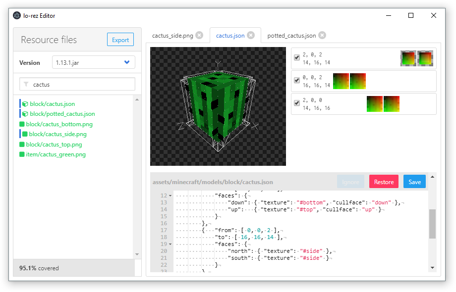

# lo-rez Editor

*lo-rez Editor* is an [Electron](http://electron.atom.io)-powered editor to make the creation and editing of [*lo-rez*](https://github.com/eiszfuchs/lo-rez) easier to achieve.





## Usage

The idea is that you clone the [*lo-rez*](https://github.com/eiszfuchs/lo-rez) repository into `lo-rez` within this editor's directory, so always the most up-to-date state is being worked on.


### Running

```bash
npm install # or yarn
npm start
```
